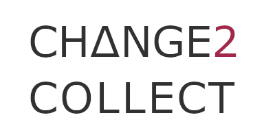

# Change2Collect
> Monorepo for Change2Collect (C2C) application

### Make Commands
In order to use the comfy `make` commands you should have the
[Make Automation Tool](https://www.gnu.org/software/make/manual/make.html) installed,
but it is not absolutely necessary to get the work done.  
*You can check by running `make -v` or `gmake -v` - each is equally efficient from v3 or later*

#### Makefile support for your IDE
[Jetbrains](https://plugins.jetbrains.com/plugin/9333-makefile-support) or
[VS Code](https://marketplace.visualstudio.com/items?itemName=carlos-algms.make-task-provider)

## Local Development

### Setup
#### Make command
```bash
make setup-dev
```

#### Or step by step
##### 1. Backend
Follow the [backend setup instructions](./backend/README.md)

##### 2. Frontend
Follow the [frontend setup instructions](./frontend/README.md)

### Run the project
#### Make command
```bash
make dev
```

#### Or step by step
##### 1. Backend
Follow the [backend start instructions](./backend/README.md)

##### 2. Frontend
Follow the [frontend start instructions](./frontend/README.md)

### URL
Visit [https://localhost](https://localhost)
